# Flowchart Alur Aplikasi Helpdesk Ticketing Terintegrasi AI

Berikut adalah diagram alur (*flowchart*) terintegrasi yang menjelaskan siklus hidup tiket dan interaksi kecerdasan buatan (AI) di dalam sistem helpdesk dari sisi **User**, **Sistem/AI**, dan **Teknisi**.

```mermaid
flowchart TD
    %% Styling
    classDef user fill:#e1f5fe,stroke:#0288d1,stroke-width:2px,color:#01579b;
    classDef system fill:#efebe9,stroke:#5d4037,stroke-width:2px,color:#3e2723;
    classDef ai fill:#ede7f6,stroke:#7e57c2,stroke-width:2px,color:#4a148c;
    classDef tech fill:#e8f5e9,stroke:#388e3c,stroke-width:2px,color:#1b5e20;

    %% Nodes
    Start([Mulai]) --> UserLogin[User Login ke Sistem]:::user
    UserLogin --> ChatbotAI["Konsultasi dengan Chatbot AI<br>(First-Level Support)"]:::user
    
    ChatbotAI --> SolveCheck{"Apakah Solusi<br>AI Membantu?"}:::user
    
    SolveCheck -- Ya --> EndSolved([Selesai - Tidak Perlu Tiket])
    
    SolveCheck -- Tidak --> TicketChoice{"Metode Pembuatan<br>Tiket?"}:::user
    
    TicketChoice -- "Otomatis (via Chatbot)" --> AIAnalyze["AI Menganalisis Obrolan Chat<br>dan Membuat Draf Tiket"]:::ai
    AIAnalyze --> FillDraft["Pre-fill Form Tiket<br>(Judul, Deskripsi, Kategori, Prioritas)"]:::system
    FillDraft --> UserConfirm[User Konfirmasi Draf Tiket]:::user
    UserConfirm --> SaveTicketAuto["Simpan Tiket ke Database<br>(Menyimpan Data Analisis AI)"]:::system
    
    TicketChoice -- "Manual (Form Biasa)" --> FillManual[User Isi Form Tiket Manual]:::user
    FillManual --> SyncAnalyze[AI Menganalisis Input Secara Sinkron]:::ai
    SyncAnalyze --> SaveTicketManual["Simpan Tiket ke Database<br>(Menyimpan Data Analisis AI)"]:::system

    SaveTicketAuto --> NotifyTech[Kirim Notifikasi Tiket Baru ke Teknisi]:::system
    SaveTicketManual --> NotifyTech
    
    NotifyTech --> TechDashboard[Teknisi Lihat Tiket Baru di Dashboard]:::tech
    TechDashboard --> SelfAssign["Teknisi Mengambil Tiket<br>(Self-Assignment)"]:::tech
    
    SelfAssign --> StatusProgress[Status Tiket Berubah: 'Ditangani']:::system
    StatusProgress --> NotifyUser[Kirim Notifikasi ke User]:::system
    
    NotifyUser --> TechShow[Teknisi Buka Detail Tiket]:::tech
    
    TechShow --> AIAssistantPanel["Asisten AI Menyajikan:<br>1. Ringkasan Masalah<br>2. Kemungkinan Penyebab<br>3. Rekomendasi Penanganan<br>4. Tingkat Keyakinan"]:::ai
    TechShow --> SimilarCases["AI Menampilkan Kasus Serupa<br>(Top 3 Tiket Selesai/Tutup<br>sebagai Knowledge Base)"]:::ai
    
    AIAssistantPanel --> TechRepair["Teknisi Melakukan Perbaikan<br>(Dapat Berdiskusi via Chat Tiket)"]:::tech
    SimilarCases --> TechRepair
    
    TechRepair --> MarkResolved["Teknisi Mengubah Status ke 'Resolved'<br>& Input Catatan Penyelesaian"]:::tech
    
    MarkResolved --> AIResolution["AI Membuat Ringkasan Penyelesaian<br>Secara Otomatis"]:::ai
    AIResolution --> SaveResolution["Simpan Ringkasan Penyelesaian<br>ke Kolom 'resolution_summary'"]:::system
    
    SaveResolution --> UserVerify{"User Konfirmasi<br>Penyelesaian?"}:::user
    
    UserVerify -- Setuju --> StatusClosed[Status Tiket Berubah: 'Closed']:::system
    StatusClosed --> KBUpdate["Tiket Masuk ke Knowledge Base<br>untuk Kasus Serupa di Masa Depan"]:::system
    KBUpdate --> EndClosed([Tiket Ditutup - Selesai])
    
    UserVerify -- "Kendala Masih Ada (Batas Waktu < 48 Jam)" --> ReopenTicket["User Klik 'Buka Kembali Tiket'"]:::user
    ReopenTicket --> StatusReopened["Status Kembali ke 'In Progress' / 'Open'"]:::system
    StatusReopened --> NotifyTechReopen[Kirim Notifikasi ke Teknisi]:::system
    NotifyTechReopen --> TechShow
```

### Penjelasan Alur Kerja Utama

1. **Konsultasi & Triage (Tahap 1 & 2)**
   * User berkonsultasi terlebih dahulu dengan AI Chatbot. Jika kendala tidak teratasi, sistem menawarkan pembuatan tiket otomatis.
   * AI akan memproses riwayat percakapan tersebut guna mem-prefill form input (kategori, deskripsi, prioritas, dsb.), meminimalkan subjektivitas user, dan mempermudah proses input data.
   
2. **AI Assistant untuk Staf Support (Tahap 5 & 6)**
   * Begitu teknisi mengambil tiket (*Self-Assignment*), AI menyajikan informasi prediktif berupa ringkasan masalah, perkiraan penyebab, langkah rekomendasi, serta keyakinan AI.
   * AI juga memindai basis data kasus lama yang berstatus `resolved` atau `closed` untuk menampilkan hingga 3 tiket paling mirip beserta solusi sukses yang pernah diterapkan sebelumnya.

3. **Dokumentasi Knowledge Base Otomatis (Tahap 8)**
   * Ketika tiket dinyatakan selesai (`resolved`) oleh teknisi, AI menganalisis transkrip obrolan tiket dan catatan teknisi untuk merangkum hasil penyelesaian secara terstruktur.
   * Ringkasan ini otomatis disimpan pada kolom `resolution_summary` dan langsung tersaji sebagai referensi *knowledge base* bagi pencarian kasus serupa di masa mendatang.
